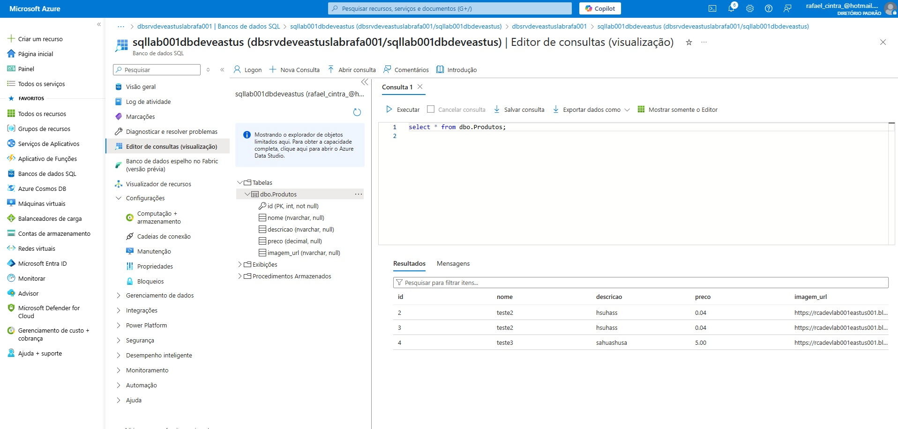

# Cadastro de Produtos com Streamlit



Este projeto é uma aplicação web desenvolvida em Python com **Streamlit**, permitindo:

✅ Cadastro de produtos  
✅ Upload de imagens no **Azure Blob Storage**  
✅ Armazenamento das informações no **Azure SQL Database**  
✅ Visualização dos produtos cadastrados com **paginação e layout responsivo**

## 💻 Tecnologias utilizadas

- Python 3
- Streamlit
- Azure Blob Storage
- Azure SQL Database
- pymssql
- dotenv

## 📸 Prints

|  |  |  |

## ✨ O que aprendi

- Como conectar uma aplicação Python com **Azure SQL Database**
- Como realizar upload de arquivos diretamente no **Azure Blob Storage** usando `azure-storage-blob`
- Como usar `Streamlit` para criar uma interface web de forma rápida
- Como usar `st.columns()` e `st.number_input()` para **layout em colunas** e **paginação**
- A importância da **validação de dados** e tratamento de exceções

## 📝 Possibilidades de melhorias

- Adicionar login/autenticação de usuários
- Permitir edição e exclusão de produtos cadastrados
- Criar filtros de busca por nome ou preço
- Usar banco de dados local SQLite para testes offline

## 🚀 Como rodar o projeto localmente

1. Clone este repositório:

```bash
git clone https://github.com/seu-usuario/cadastro-de-produtos-streamlit.git
